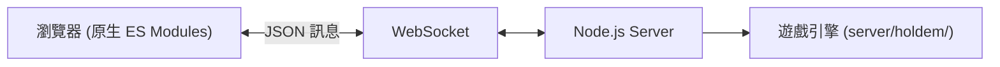

# LAN Hub

多人遊戲平台，開瀏覽器就能玩。支援區域網路及公開網路連線，建立房間即可開始遊戲。

內建老闆鍵（F9）一鍵偽裝成產品規格文件，安心摸魚。

**線上體驗：** <https://lan-hub.onrender.com>

## 功能

- 即時大廳：房間列表自動更新，支援建立 / 加入 / 旁觀，首次進入需設定暱稱
- 德州撲克：完整規則引擎（盲注、下注輪、邊池、攤牌評手），Server-authoritative 架構確保公平
- 座位管理：旁觀者可入座（牌局進行中暫停開放）、玩家可離座、暫離 / 回座、開房時可選擇允許補碼
- 行動計時：每次行動 60 秒，逾時自動 check / fold；每手結束 10 秒後自動開下一手
- 牌局紀錄：房內保留最近 20 手結果，可展開查看
- 聊天室：右側可拖曳調寬的側欄，大廳與房間各自獨立頻道，保留最近 100 則歷史，進出房、重連、房主轉移以系統訊息提示
- 斷線重連：60 秒內重連自動恢復座位與籌碼
- 房主遷移：房主離開時自動指派下一位玩家
- 老闆鍵：F9 切換偽裝畫面，favicon 紅點提示輪到你行動
- 深淺主題切換：自動偵測系統偏好，可手動切換
- 音效提示：輪到你時發出提示音

## 快速開始

### 線上遊玩

開啟 <https://lan-hub.onrender.com> 即可進入大廳（免費方案，首次載入需約 30 秒喚醒）。

### 本機啟動

需要 Node.js 20 以上。

```bash
npm install
npm start
```

伺服器啟動後會印出區域網路 IP，同網路的裝置用瀏覽器開啟該網址即可加入。若 port 已被佔用，會自動結束佔用的舊程序後重試。

預設 port 為 `3131`，可透過環境變數覆蓋：

```bash
PORT=8080 npm start
```

## 技術架構

| 層 | 技術 |
|-|-|
| Runtime | Node.js (ESM) |
| 通訊 | WebSocket (`ws`) |
| 前端 | 原生 ES Modules，無框架、無打包 |
| 狀態 | 記憶體內 Map，無資料庫 |
| 安全 | Server-authoritative + `viewFor()` 每人只看到自己的手牌 |
| 部署 | Render Free tier，push 到 main 自動部署 |



## 專案結構

```
lan-hub/
├── server.js                 # HTTP + WebSocket 啟動入口
├── render.yaml               # Render 部署 Blueprint
├── server/
│   ├── rooms.js              # 房間 / 玩家註冊、廣播、聊天、計時器、房主轉移
│   ├── handlers.js           # 訊息類型 → handler 分派
│   └── holdem/
│       ├── engine.js          # 遊戲狀態機（發牌、盲注、補碼、暫離、viewFor）
│       ├── hand.js            # 下注輪、邊池、攤牌
│       ├── evaluate.js        # 牌型評估
│       └── util.js            # 共用常數與工具
├── public/
│   ├── index.html            # 大廳 / 房間 / 聊天側欄 / 偽裝畫面
│   ├── app.js                # WebSocket 客戶端、遊戲模組載入、主題切換
│   ├── lobby.js              # 房間列表、建房 modal、暱稱 modal
│   ├── chat.js               # 聊天側欄
│   ├── stealth.js            # 老闆鍵偽裝模式
│   ├── ui.js                 # escapeHtml / showToast
│   ├── style.css
│   └── games/
│       └── texas-holdem/
│           ├── index.js       # 遊戲 DOM 掛載與控制、音效、行動倒數、牌局紀錄
│           ├── view.js        # HTML 渲染工具（環形座位）
│           └── holdem.css
└── package.json
```

## 擴充遊戲

採用可插拔模組架構，新增遊戲不需修改大廳程式碼：

1. 在 `server/` 新增遊戲引擎模組
2. 在 `public/games/` 新增前端模組，實作 `mount()` 介面
3. 在 server 的 `GAME_CATALOG` 和 client 的 `GAME_MODULES` 各加一筆註冊

## 設計決策

- **Server-authoritative**：所有規則運算、洗牌（`crypto.randomInt`）、牌型判定皆在伺服器端執行，客戶端僅負責渲染與輸入
- **資訊隔離**：`viewFor()` 為每位玩家產生專屬視角，他人手牌以 `['back','back']` 傳送
- **零建置**：無打包工具、無框架，瀏覽器直接載入 ES Modules
- **零儲存**：所有狀態存在記憶體，重啟即清空；`localStorage` 保存 `clientId` 與暱稱供重連使用，以及主題與聊天欄寬度偏好

## License

ISC
